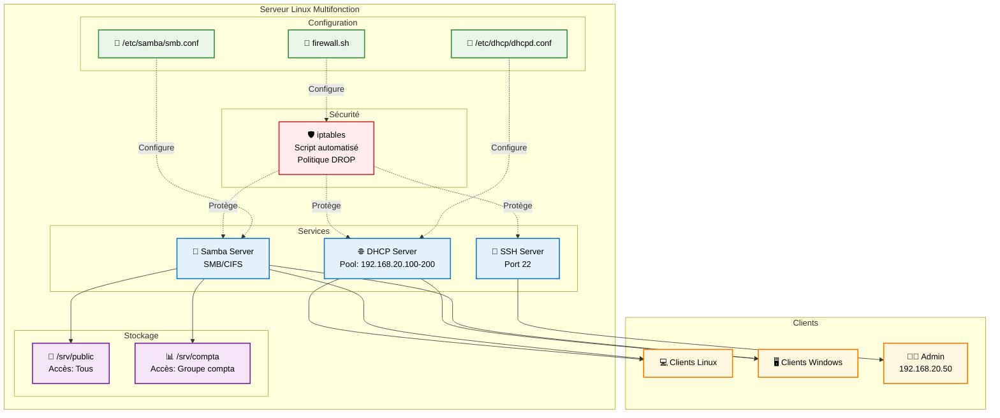

# Infrastructure Réseau Sécurisée – Samba, DHCP, iptables

> **Projet LPIC-2** - Serveur Linux multifonction automatisé avec Ansible  
> **Durée estimée** : 4h30 | **Niveau** : Intermédiaire

## 📋 Description du projet

Ce projet implémente une solution complète d'infrastructure réseau pour PME comprenant :
- **Serveur DHCP** pour l'attribution dynamique d'adresses IP
- **Serveur Samba** pour le partage de fichiers multi-plateforme
- **Pare-feu iptables** automatisé pour la sécurisation

L'ensemble est déployé automatiquement via **Ansible** pour un provisionnement rapide et reproductible.

## Schéma d'infrastructure



## 🛠️ Architecture technique

### Services configurés

| Service | Port(s) | Description | Configuration |
|---------|---------|-------------|---------------|
| **DHCP** | 67-68/UDP | Attribution IP automatique | Pool: 192.168.20.100-200 |
| **Samba** | 137-139,445/TCP | Partage de fichiers | 2 partages : public + compta |
| **SSH** | 22/TCP | Administration à distance | Accès restreint admin |
| **iptables** | - | Pare-feu système | Politique DROP par défaut |

### Plan d'adressage

```
Réseau principal : 192.168.20.0/24
├── Passerelle     : 192.168.20.1
├── Pool DHCP      : 192.168.20.100-200
├── Admin réservé  : 192.168.20.50
└── DNS            : 8.8.8.8
```

## 🚀 Déploiement rapide

### Prérequis

```bash
# Installation d'Ansible
sudo apt update && sudo apt install ansible

# Vérification
ansible --version
```

### Configuration VM cible

1. **Modifier l'inventaire** `server/host` :
```ini
[servers]
ma-vm ansible_host=VOTRE_IP_VM ansible_user=VOTRE_USER
```

2. **Personnaliser les variables** `server/vars.yaml` :
```yaml
# Adapter selon votre réseau
dhcp_start: "192.168.20.100"
dhcp_end: "192.168.20.200"
gateway: "192.168.20.1"

# Utilisateurs Samba
samba_users:
  - { name: "admin", password: "AdminPass123", groups: "compta" }
  - { name: "user1", password: "UserPass123", groups: "" }
```

### Lancement du déploiement

```bash
cd server/
chmod +x deploy.sh
./deploy.sh
```

Le script effectue automatiquement :
- ✅ Test de connectivité SSH
- 🔍 Vérification syntaxe Ansible  
- 🧪 Simulation (dry-run)
- ⚡ Déploiement réel (après confirmation)

## 📁 Structure du projet

```
tp-lpic102/
├── README.md                 # Ce fichier
└── server/                   # Infrastructure Ansible
    ├── playbook.yaml         # Playbook principal
    ├── vars.yaml            # Variables de configuration
    ├── host                 # Inventaire des serveurs
    ├── ansible.cfg          # Configuration Ansible
    ├── deploy.sh            # Script de déploiement
    └── templates/           # Templates Jinja2
        ├── dhcp.conf.j2     # Configuration DHCP
        ├── smb.conf.j2      # Configuration Samba
        └── fw.sh.j2         # Script firewall
```

## 🧪 Tests et validation

### Vérification des services

```bash
# Statut des services
ansible servers -m shell -a 'systemctl status isc-dhcp-server'
ansible servers -m shell -a 'systemctl status smbd'

# Test Samba
ansible servers -m shell -a 'smbclient -L localhost -U guest%'

# Vérification firewall
ansible servers -m shell -a 'iptables -L INPUT -n'
```

### Tests côté client

```bash
# Test DHCP (libérer/renouveler IP)
sudo dhclient -r && sudo dhclient

# Montage Samba Linux
sudo mount -t cifs //IP_SERVEUR/public /mnt -o guest

# Windows : accéder à \\IP_SERVEUR\public
```

## 🔧 Détails techniques

### Automatisation Ansible

Le déploiement utilise :
- **Templates Jinja2** (`.j2`) pour personnaliser les configurations
- **Variables centralisées** dans `vars.yaml`
- **Handlers** pour redémarrer les services automatiquement
- **Idempotence** : peut être relancé sans risque

### Sécurité implémentée

```bash
# Politique firewall (extraits)
iptables -P INPUT DROP          # Deny by default
iptables -A INPUT -i lo -j ACCEPT                    # Loopback OK
iptables -A INPUT -p tcp -s 192.168.20.50 --dport 22 -j ACCEPT  # SSH admin only
iptables -A INPUT -p tcp --dport 445 -j ACCEPT      # Samba
iptables -A INPUT -p udp --dport 67:68 -j ACCEPT    # DHCP
```

### Partages Samba

| Partage | Chemin | Permissions | Description |
|---------|--------|-------------|-------------|
| `public` | `/srv/public` | Lecture/Écriture tous | Partage général |
| `compta` | `/srv/compta` | Groupe `compta` uniquement | Documents sensibles |

## 🎯 Objectifs pédagogiques atteints

- ✅ **Configuration DHCP** : Pool dynamique + DNS
- ✅ **Serveur Samba** : Multi-plateforme avec permissions
- ✅ **Script iptables** : Pare-feu automatisé sécurisé
- ✅ **Automatisation** : Déploiement Ansible reproductible
- ✅ **Documentation** : Infrastructure as Code documentée

## 🔍 Extensions possibles

- **Monitoring** : Nagios/Zabbix pour supervision
- **Sauvegarde** : Scripts rsync + cron automatisés  
- **SSL/TLS** : Chiffrement des communications Samba
- **LDAP** : Authentification centralisée
- **Web Interface** : Cockpit pour administration GUI

## 📞 Support

En cas de problème :

1. **Vérifier la connectivité** : `ansible servers -m ping`
2. **Logs système** : `journalctl -u isc-dhcp-server -f`
3. **Debug Samba** : `testparm /etc/samba/smb.conf`
4. **Firewall** : `iptables -L -n -v`

---

> **Note** : Ce projet respecte les bonnes pratiques LPIC-2 et peut servir de base pour un environnement de production avec adaptations sécuritaires supplémentaires.