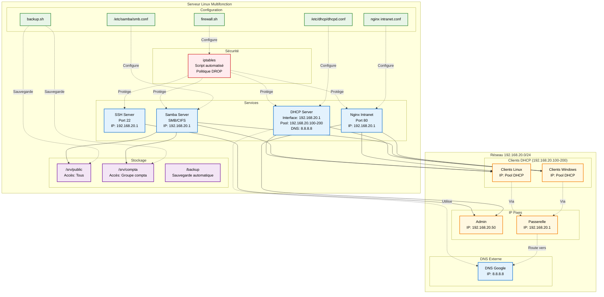

# Infrastructure Réseau Sécurisée – Samba, DHCP, iptables

> **Projet LPIC-2** - Serveur Linux multifonction automatisé avec Ansible  
> **Durée estimée** : 4h30 | **Niveau** : Intermédiaire

## Description du projet

Ce projet implémente une solution complète d'infrastructure réseau pour PME comprenant :
- **Serveur DHCP** pour l'attribution dynamique d'adresses IP
- **Serveur Samba** pour le partage de fichiers multi-plateforme
- **Pare-feu iptables** automatisé pour la sécurisation
- **Intranet web** (bonus) pour le monitoring des services
- **Sauvegarde automatique** (bonus) avec rsync et cron
- **Configuration persistante** (bonus) avec iptables-persistent

L'ensemble est déployé automatiquement via **Ansible** pour un provisionnement rapide et reproductible.

## Schéma d'infrastructure



## Architecture technique

### Services configurés

| Service | Port(s) | Description | Configuration |
|---------|---------|-------------|---------------|
| **DHCP** | 67-68/UDP | Attribution IP automatique | Pool: 192.168.20.100-200 |
| **Samba** | 137-139,445/TCP | Partage de fichiers | 2 partages : public + compta |
| **SSH** | 22/TCP | Administration à distance | Accès restreint admin |
| **Nginx** | 80/TCP | Intranet PME (bonus) | Interface de monitoring |
| **iptables** | - | Pare-feu système | Politique DROP par défaut |
| **rsync+cron** | - | Sauvegarde automatique (bonus) | Quotidienne à 2h00 |

### Plan d'adressage

```
Réseau principal : 192.168.20.0/24
├── Passerelle     : 192.168.20.1
├── Pool DHCP      : 192.168.20.100-200
├── Admin réservé  : 192.168.20.50
└── DNS            : 8.8.8.8
```

## Livrables du TP

### Livrables requis

#### 1. **Schéma réseau avec plan d'adressage**
> Voir diagramme Mermaid ci-dessus avec architecture complète[https://github.com/M4XGO/tp-lpic102/blob/main/README.md#sch%C3%A9ma-dinfrastructure]

#### 2. **Fichiers de configuration DHCP et Samba**

**Configuration DHCP** (`templates/dhcp.conf.j2`)
```ini
interface ens36;

default-lease-time 600;
max-lease-time 7200;
authoritative;

subnet 192.168.20.0 netmask 255.255.255.0 {
    range 192.168.20.100 192.168.20.200;
    option domain-name-servers 8.8.8.8;
    option domain-name "entreprise.local";
}
```

**Configuration Samba** (`templates/smb.conf.j2`)
```ini
[global]
   workgroup = WORKGROUP
   server string = Serveur Samba LPIC-2
   netbios name = SRVLPIC2
   security = user
   map to guest = bad user

[public]
   comment = Partage Public
   path = /srv/public
   browsable = yes
   writable = yes
   guest ok = yes
   read only = no
   create mask = 0755

[compta]
   comment = Partage Comptabilité  
   path = /srv/compta
   browsable = yes
   writable = yes
   valid users = @compta
   read only = no
   create mask = 0750
```

#### 3. **Script iptables commenté et expliqué**

**Script firewall complet** (`templates/firewall.sh.j2`)
```bash
#!/bin/bash
# ===================================================================
# Script de configuration firewall iptables - LPIC-2
# Objectif : Sécuriser un serveur multifonction (DHCP + Samba + SSH)
# Politique : Deny by default - N'autoriser que les services nécessaires
# ===================================================================

# 1. REMISE À ZÉRO DES RÈGLES EXISTANTES
iptables -F                     # Flush toutes les règles
iptables -X                     # Supprimer les chaînes personnalisées

# 2. POLITIQUE PAR DÉFAUT - SÉCURITÉ MAXIMALE
iptables -P INPUT DROP          # Bloquer tout trafic entrant
iptables -P FORWARD DROP        # Bloquer tout trafic de transit  
iptables -P OUTPUT ACCEPT       # Autoriser tout trafic sortant

# 3. INTERFACE LOOPBACK - COMMUNICATION INTERNE
iptables -A INPUT -i lo -j ACCEPT

# 4. SERVEUR DHCP - ATTRIBUTION D'ADRESSES IP
iptables -A INPUT -p udp --dport 67:68 --sport 67:68 -j ACCEPT

# 5. SERVEUR SAMBA - PARTAGE DE FICHIERS
iptables -A INPUT -p tcp --dport 137:139 -j ACCEPT  # NetBIOS
iptables -A INPUT -p tcp --dport 445 -j ACCEPT      # SMB/CIFS
iptables -A INPUT -p udp --dport 137:138 -j ACCEPT  # NetBIOS UDP

# 6. SSH - ADMINISTRATION SÉCURISÉE (restreint à l'admin)
iptables -A INPUT -p tcp -s 192.168.20.50 --dport 22 -j ACCEPT

# 7. HTTP - INTRANET (bonus)
iptables -A INPUT -p tcp -s 192.168.20.0/24 --dport 80 -j ACCEPT

# 8. ICMP - DIAGNOSTIC RÉSEAU
iptables -A INPUT -p icmp --icmp-type echo-request -j ACCEPT

# 9. CONNEXIONS ÉTABLIES
iptables -A INPUT -m state --state ESTABLISHED,RELATED -j ACCEPT

# 10. JOURNALISATION DES TENTATIVES D'INTRUSION
iptables -A INPUT -j LOG --log-prefix "FIREWALL-DENY: " --log-level 4

# 11. SAUVEGARDE PERSISTANTE
iptables-save > /etc/iptables/rules.v4
```

**Explications des règles principales :**
- **Politique DROP** : Sécurité maximale par défaut
- **Loopback autorisé** : Communication interne système  
- **DHCP (67-68 UDP)** : Attribution automatique d'IP aux clients
- **Samba (137-139, 445 TCP/UDP)** : Partage de fichiers Windows/Linux
- **SSH restreint** : Administration depuis 192.168.20.50 uniquement
- **Journalisation** : Traçabilité des tentatives d'intrusion
- **Persistance** : Règles conservées après redémarrage

#### 4. **Rapport technique détaillé**
> Ce README constitue le rapport technique complet avec architecture, configuration et procédures

### Extensions bonus implémentées

#### 1. **Sauvegarde automatique avec rsync et cron**
- **Script** : `/opt/backup.sh` (généré depuis `templates/backup.sh.j2`)
- **Planification** : Quotidienne à 2h00 via cron
- **Contenu** : Données des partages Samba uniquement
- **Méthode** : Synchronisation optimisée (ne copie que les fichiers modifiés)
- **Avantage** : Évite les doublons, très rapide

#### 2. **Configuration persistante du pare-feu** 
- **Package** : `iptables-persistent` installé automatiquement
- **Sauvegarde** : Règles dans `/etc/iptables/rules.v4`
- **Persistance** : Règles rechargées au boot automatiquement

#### 3. **Site intranet local avec Nginx**
- **URL** : `http://IP_SERVEUR` 
- **Interface** : Dashboard de monitoring des services
- **Fonctionnalités** :
  - Statut des services en temps réel
  - Informations réseau (DHCP, Samba)
  - État du firewall
  - Statut des sauvegardes
  - Informations système

## Déploiement rapide

### Prérequis

```bash
# Installation d'Ansible
sudo apt update && sudo apt install ansible

# Vérification
ansible --version
```

### Configuration VM cible

1. **Modifier l'inventaire** `server/host` :
```ini
[servers]
srv ansible_host=172.20.10.4 ansible_user=debian
```

2. **Personnaliser les variables** `server/vars.yaml` :
```yaml
# Adapter selon votre réseau
dhcp_start: "192.168.20.100"
dhcp_end: "192.168.20.200"
dhcp_interface: "ens36"
dns: "8.8.8.8"

# Utilisateurs Samba
samba_users:
  - { name: "admin", password: "AdminPass123", groups: "compta" }
  - { name: "user1", password: "UserPass123", groups: "" }
```

### Lancement du déploiement

```bash
cd server/
chmod +x deploy.sh
./deploy.sh
```

Le script effectue automatiquement :
- Test de connectivité SSH
- Vérification syntaxe Ansible  
- Simulation (dry-run)
- Déploiement réel (après confirmation)

## Structure du projet

```
tp-lpic102/
├── README.md                      # Ce fichier (rapport technique)
└── server/                        # Infrastructure Ansible
    ├── playbook.yaml              # Playbook principal
    ├── vars.yaml                  # Variables de configuration
    ├── host                       # Inventaire des serveurs
    ├── ansible.cfg                # Configuration Ansible
    ├── deploy.sh                  # Script de déploiement
    └── templates/                 # Templates Jinja2
        ├── dhcp.conf.j2           # Configuration DHCP
        ├── smb.conf.j2            # Configuration Samba
        ├── firewall.sh.j2         # Script firewall (commenté)
        ├── backup.sh.j2           # Script sauvegarde (bonus)
        ├── nginx-intranet.conf.j2 # Config Nginx (bonus)
        └── intranet-index.html.j2 # Page intranet (bonus)
```

## Tests et validation

### Vérification des services

```bash
# Statut des services
ansible servers -m shell -a 'systemctl status isc-dhcp-server'
ansible servers -m shell -a 'systemctl status smbd'
ansible servers -m shell -a 'systemctl status nginx'

# Test Samba
ansible servers -m shell -a 'smbclient -L localhost -U guest%'

# Vérification firewall
ansible servers -m shell -a 'iptables -L INPUT -n'

# Test intranet
curl http://IP_SERVEUR
```

### Tests côté client

```bash
# Test DHCP (libérer/renouveler IP)
sudo dhclient -r && sudo dhclient

# Montage Samba Linux
sudo mount -t cifs //IP_SERVEUR/public /mnt -o guest

# Windows : accéder à \\IP_SERVEUR\public
# Intranet : http://IP_SERVEUR dans navigateur
```

### Vérification des bonus

```bash
# Sauvegarde automatique
ansible servers -m shell -a 'ls -la /backup/'
ansible servers -m shell -a 'crontab -l | grep backup'

# Persistance firewall
ansible servers -m shell -a 'ls -la /etc/iptables/rules.v4'

# Intranet
ansible servers -m shell -a 'systemctl status nginx'
```

## Détails techniques

### Automatisation Ansible

Le déploiement utilise :
- **Templates Jinja2** (`.j2`) pour personnaliser les configurations
- **Variables centralisées** dans `vars.yaml`
- **Handlers** pour redémarrer les services automatiquement
- **Idempotence** : peut être relancé sans risque

### Sécurité implémentée

```bash
# Politique firewall (extraits)
iptables -P INPUT DROP          # Deny by default
iptables -A INPUT -i lo -j ACCEPT                    # Loopback OK
iptables -A INPUT -p tcp -s 192.168.20.50 --dport 22 -j ACCEPT  # SSH admin only
iptables -A INPUT -p tcp --dport 445 -j ACCEPT      # Samba
iptables -A INPUT -p udp --dport 67:68 -j ACCEPT    # DHCP
iptables -A INPUT -p tcp -s 192.168.20.0/24 --dport 80 -j ACCEPT # HTTP local
```

### Partages Samba

| Partage | Chemin | Permissions | Description |
|---------|--------|-------------|-------------|
| `public` | `/srv/public` | Lecture/Écriture tous | Partage général |
| `compta` | `/srv/compta` | Groupe `compta` uniquement | Documents sensibles |

### Sauvegarde automatique

- **Fréquence** : Quotidienne à 2h00 du matin
- **Contenu** : Données des partages Samba (/srv/public et /srv/compta)
- **Méthode** : Synchronisation rsync optimisée
- **Avantage** : Ne copie que les fichiers nouveaux/modifiés

## Objectifs pédagogiques atteints

- Configuration DHCP : Pool dynamique + DNS
- Serveur Samba : Multi-plateforme avec permissions
- Script iptables : Pare-feu automatisé sécurisé et commenté
- Automatisation : Déploiement Ansible reproductible
- Documentation : Infrastructure as Code documentée
- Bonus : Intranet, sauvegarde, persistance firewall

## Extensions possibles

- **Monitoring** : Nagios/Zabbix pour supervision avancée
- **SSL/TLS** : Chiffrement des communications Samba
- **LDAP** : Authentification centralisée
- **VPN** : Accès distant sécurisé
- **Load Balancing** : Haute disponibilité

## Support

En cas de problème :

1. **Vérifier la connectivité** : `ansible servers -m ping`
2. **Logs système** : `journalctl -u isc-dhcp-server -f`
3. **Debug Samba** : `testparm /etc/samba/smb.conf`
4. **Firewall** : `iptables -L -n -v`
5. **Nginx** : `nginx -t && systemctl status nginx`
6. **Sauvegarde** : `tail -f /var/log/backup.log`

---

> **Note** : Ce projet respecte les bonnes pratiques LPIC-2 et peut servir de base pour un environnement de production avec adaptations sécuritaires supplémentaires.
