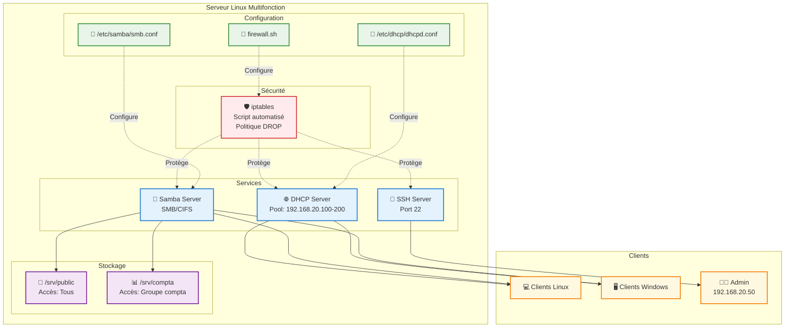

```mermaid
graph TB
    subgraph "Serveur Linux Multifonction"
        subgraph "Services"
            DHCP[🌐 DHCP Server<br/>Pool: 192.168.20.100-200]
            SAMBA[📁 Samba Server<br/>SMB/CIFS]
            SSH[🔐 SSH Server<br/>Port 22]
        end
        
        subgraph "Sécurité"
            IPTABLES[🛡️ iptables<br/>Script automatisé<br/>Politique DROP]
        end
        
        subgraph "Stockage"
            PUBLIC[📂 /srv/public<br/>Accès: Tous]
            COMPTA[📊 /srv/compta<br/>Accès: Groupe compta]
        end
        
        subgraph "Configuration"
            DHCP_CONF[📝 /etc/dhcp/dhcpd.conf]
            SAMBA_CONF[📝 /etc/samba/smb.conf]
            FW_SCRIPT[📝 firewall.sh]
        end
    end
    
    subgraph "Clients"
        LINUX[💻 Clients Linux]
        WINDOWS[🖥️ Clients Windows]
        ADMIN[👨‍💼 Admin<br/>192.168.20.50]
    end
    
    %% Connexions services
    DHCP --> LINUX
    DHCP --> WINDOWS
    
    SAMBA --> PUBLIC
    SAMBA --> COMPTA
    SAMBA --> LINUX
    SAMBA --> WINDOWS
    
    SSH --> ADMIN
    
    IPTABLES -.->|Protège| DHCP
    IPTABLES -.->|Protège| SAMBA
    IPTABLES -.->|Protège| SSH
    
    %% Configuration
    DHCP_CONF -.->|Configure| DHCP
    SAMBA_CONF -.->|Configure| SAMBA
    FW_SCRIPT -.->|Configure| IPTABLES
    
    classDef service fill:#e3f2fd,stroke:#1976d2,stroke-width:2px
    classDef security fill:#ffebee,stroke:#d32f2f,stroke-width:2px
    classDef storage fill:#f3e5f5,stroke:#7b1fa2,stroke-width:2px
    classDef config fill:#e8f5e8,stroke:#388e3c,stroke-width:2px
    classDef client fill:#fff8e1,stroke:#f57c00,stroke-width:2px
    
    class DHCP,SAMBA,SSH service
    class IPTABLES security
    class PUBLIC,COMPTA storage
    class DHCP_CONF,SAMBA_CONF,FW_SCRIPT config
    class LINUX,WINDOWS,ADMIN client
```